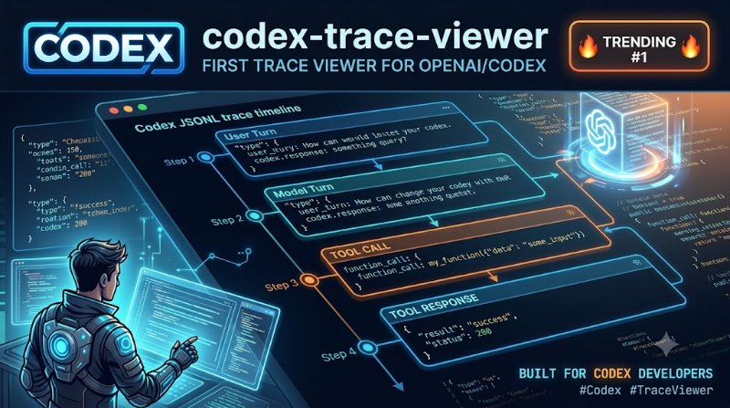

# codex-trace-viewer

> **First trace viewer for openai/codex — #1 trending today (2026-08-23). Parse Codex JSONL, render timeline, search, stats. Local-first, zero cloud.**

<p align="center">
  
</p>

<p align="center">
  <em>Hero: Codex JSONL → timeline with tool calls — trending #1 — generated with Gemini</em>
</p>

  

No viewer exists for Codex yet (vs 3+ for Claude). This is first mover — high demoability (timeline video), high shareability.

```bash
npx codex-trace-viewer view examples/sample-codex.jsonl
npx codex-trace-viewer stats examples/sample-codex.jsonl
npx codex-trace-viewer search examples/sample-codex.jsonl "write"
npx codex-trace-viewer export examples/sample-codex.jsonl report.md
npx codex-trace-viewer demo
```

---

## Why Codex?

`openai/codex` is #1 trending Aug 23 (new entrant, orangebot.ai), zero tooling. High demoability (timeline video), high shareability. This is first mover to own the Codex trace niche.

## Demo

```bash
codex-trace-viewer demo
# Trace: 4 turns, 1 tool calls, 2050ms total
```

```
┌───┬───────────┬──────────┬──────────────────────────────────┐
│ # │ Role      │ Duration │ Preview                          │
├───┼───────────┼──────────┼──────────────────────────────────┤
│ 0 │ user      │ -        │ hello codex                      │
│ 1 │ assistant │ 1200ms   │ hi (+ 1 tool_calls)              │
│ 2 │ tool      │ 50ms     │ file content                     │
│ 3 │ assistant │ 800ms    │ done                             │
└───┴───────────┴──────────┴──────────────────────────────────┘
```

```bash
codex-trace-viewer view examples/sample-codex.jsonl --json | jq .stats
```

## Installation

**One-liner (npx):**
```bash
npx codex-trace-viewer view examples/sample-codex.jsonl
npx codex-trace-viewer view trace.jsonl --json
```

**Global:**
```bash
npm install -g codex-trace-viewer
codex-trace view trace.jsonl
```

**From source:**
```bash
git clone https://github.com/trenysx/codex-trace-viewer
cd codex-trace-viewer
npm install
npm test
```

## Usage

```bash
# View trace
codex-trace-viewer view trace.jsonl
codex-trace-viewer view trace.jsonl --json

# Stats
codex-trace-viewer stats trace.jsonl
codex-trace-viewer stats trace.jsonl --json

# Search
codex-trace-viewer search trace.jsonl "write"
codex-trace-viewer search trace.jsonl "tool" --json

# Export markdown
codex-trace-viewer export trace.jsonl report.md

# Demo (no file)
codex-trace-viewer demo
```

### CLI Options (shared)

| Command | Key Options |
|---------|-------------|
| `view <file>` | `--json` |
| `stats <file>` | `--json` |
| `search <file> <term>` | `--json` |
| `export <file> <out>` | — |

## Features

- **Codex parser** `src/parser/codex.js:1` (codex/tool_calls/timestamp/duration/model) + generic fallback `src/parser/generic.js:1`
- **Analyzer** `src/analyzer.js:1` — counts by role, toolCalls, totalDuration, warnings (slow >5s, error hints), models, avgDuration
- **Reporter** `src/reporter.js:1` — timeline table + stats table with `cli-table3` + `chalk`
- **Search** — `search(trace, term)` filter turns by term
- **Export** — markdown report with timeline
- **Local-first** — no cloud, no API key, <100ms

## Test

```bash
npm test
```

| Test | Status |
|------|--------|
| parseCodex | PASS |
| canParseCodex | PASS |
| parseGeneric | PASS |
| parseTrace | PASS |
| analyze | PASS |
| search | PASS |

`npm test` **6/6** — see `test/`

## License

Apache-2.0 — see [LICENSE](./LICENSE). Third-party in [THIRD_PARTY.md](./THIRD_PARTY.md).

---

## Contributing

PRs welcome! See [CONTRIBUTING.md](./CONTRIBUTING.md).

1. Fork → `git checkout -b feat/foo` → commit → push → PR
2. Run `npm test` — 6 must pass
3. Test with `npx codex-trace-viewer view examples/sample-codex.jsonl`

## FAQ

**Is this official Codex viewer?** No, first community viewer. OpenAI has no viewer for Codex JSONL yet — this fills the gap.

**Does it need Codex API?** No, pure local — parse `trace.jsonl` offline.

**What format?** JSONL per line: `{"role":"user","content":"hi","timestamp":"...","duration_ms":1200,"model":"codex-mini","tool_calls":[...]}` — see `examples/sample-codex.jsonl`.

**How is it different from Claude viewers?** Claude has 3+ viewers (all Next.js). Codex has zero — first mover, high trending (#1).

## Architecture

```
src/parser/codex.js → parser/index.js → analyzer.js → reporter.js → cli.js
```

```
codex-trace-viewer/
├── src/
│   ├── cli.js              # 5 commands (view/stats/search/export/demo)
│   ├── parser/codex.js     # Codex-specific (tool_calls, duration_ms, model)
│   ├── parser/generic.js   # Fallback for plain JSONL
│   ├── parser/index.js     # canParseCodex → parseCodex : parseGeneric
│   ├── analyzer.js         # analyze (byRole, toolCalls, warnings), search
│   ├── reporter.js         # printTimeline, printStats (Table + chalk)
│   └── OPEN_CORE_BOUNDARY.md
├── test/                   # 6 tests
├── assets/
│   └── hero.jpg            # Gemini hero (800x447, 97KB)
├── examples/sample-codex.jsonl
└── package.json
```

**No build step** — pure ESM, `node src/cli.js`.

## Roadmap

- [ ] Web UI (Next.js) — timeline with search and filters (commercial)
- [ ] `codex-trace-viewer diff trace1.jsonl trace2.jsonl` — compare runs
- [ ] Real-time watch ` --watch` for live Codex runs
- [ ] Export to HTML with interactive timeline

## Examples

```bash
# View with search
codex-trace-viewer search examples/sample-codex.jsonl "tool" --json | jq

# Export report
codex-trace-viewer export examples/sample-codex.jsonl report.md && cat report.md
# # Codex Trace — examples/sample-codex.jsonl
# - Turns: 4
# - Tool calls: 1
```

## Version

Current `v0.1.0` — see [package.json](./package.json).

---

**Star if this is your first Codex trace view — and tell us what you shipped with Codex!**
